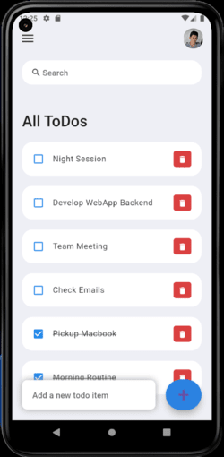
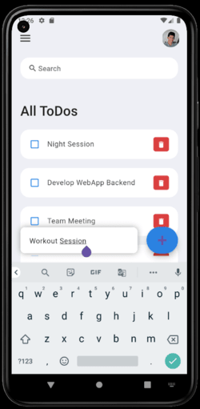
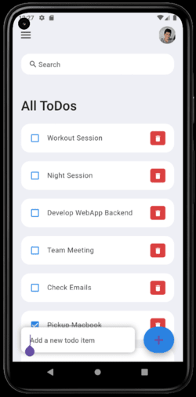
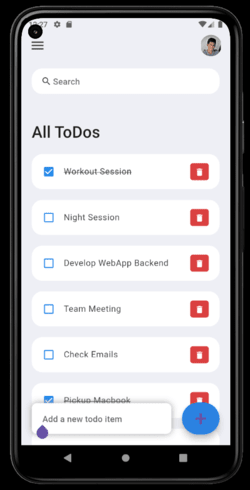

# Flutter ToDo App 1.0v

## Overview

The **Flutter ToDo App** is a simple, efficient, and user-friendly task management application built using Flutter. This app allows users to create, read, update, and delete tasks, helping them to manage their daily activities effectively. The app supports both Android and iOS platforms.

## Features

- **Add Tasks:** Users can add new tasks with a title and optional description.
- **View Tasks:** All added tasks are displayed in a list format for easy viewing.
- **Update Tasks:** Users can edit the title and description of existing tasks.
- **Delete Tasks:** Users can remove tasks that are no longer needed.
- **Task Completion:** Mark tasks as completed or pending.
- **Local Storage:** Tasks are saved locally on the device, ensuring offline access.
- **Responsive UI:** Adapts to different screen sizes and orientations.

## Screenshots






## Installation

To run this project locally, follow these steps:

1. **Clone the repository:**
    ```sh
    git clone https://github.com/IroshanRathnayake/Flutter-ToDo-App.git
    cd flutter-todo-app
    ```

2. **Install dependencies:**
    ```sh
    flutter pub get
    ```

3. **Run the app:**
    ```sh
    flutter run
    ```

## Usage

1. **Adding a Task:**
    - Click on the '+' button on the home screen.
    - Enter the task title and description.
    - Click 'Save' to add the task to the list.

2. **Editing a Task:**
    - Tap on the task you want to edit.
    - Modify the title and description as needed.
    - Click 'Update' to save changes.

3. **Deleting a Task:**
    - Swipe the task left or right on the list to reveal the delete option.
    - Confirm the deletion.

4. **Marking a Task as Completed:**
    - Tap the checkbox next to the task to mark it as completed.
    - Tap again to mark it as pending.

## Project Structure
flutter-todo-app/ <br>
|- lib/ <br>
|- models/ <br>
|- task_model.dart <br>
|- screens/ <br>
|- home_screen.dart <br>
|- add_task_screen.dart <br>
|- edit_task_screen.dart <br>
|- widgets/ <br>
|- task_list_item.dart <br>
|- main.dart <br>
|- assets/ <br>
|- images/ <br>
|- test/ <br>
|- unit_tests.dart <br>
|- pubspec.yaml <br>
|- README.md <br>

## Dependencies

The project uses the following Flutter packages:

- `provider`: State management
- `shared_preferences`: Local storage
- `flutter_slidable`: Slide actions for list items
- `intl`: Date formatting

You can find the complete list of dependencies in the `pubspec.yaml` file.

## Contributing

Contributions are welcome! If you have any ideas, suggestions, or bug reports, feel free to open an issue or submit a pull request. Please ensure that your code adheres to the project's coding standards and includes appropriate tests.

## License

This project is licensed under the MIT License. See the [LICENSE](LICENSE) file for more details.

## Acknowledgements

- [Flutter](https://flutter.dev/) - The framework used to build this app.
- [Dart](https://dart.dev/) - The programming language used in Flutter development.
- [Awesome Flutter](https://github.com/Solido/awesome-flutter) - A curated list of Flutter resources.

## Contact

If you have any questions or feedback, please contact me at [meet.iroshan@gmail.com](mailto:meet.iroshan@gmail.com).

---

*Happy Coding!*
